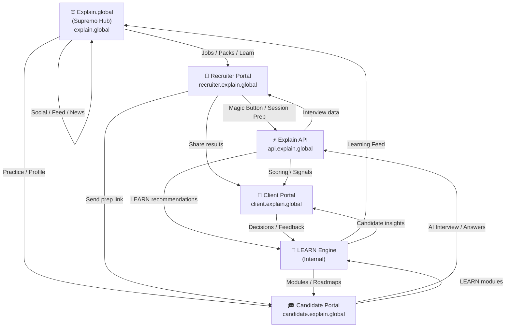

# Explain Ecosystem Architecture — 2026 Edition

> Living document. Last updated: 2026-07-26.

## Overview

Explain is a multi-portal, multi-engine ecosystem built around interviews, learning, and job discovery. It is not a single product — it is a connected platform where recruiters, candidates, clients, and the public all have dedicated entry points that feed a shared intelligence layer.

---

## Portal Map

| Portal | Domain | Audience | Status |
|--------|--------|----------|--------|
| **Explain.global** | `explain.global` | Public / Candidates | Building |
| **Recruiter Portal** | `recruiter.explain.global` | Recruiters / Agencies | Live |
| **Client Portal** | `client.explain.global` | Employers / Hiring Managers | Skeleton |
| **Candidate Portal** | `candidate.explain.global` | Candidates | Skeleton |
| **Explain API** | `api.explain.global` | Internal (all portals) | Live |
| **LEARN Engine** | Internal service | Internal (all portals) | Designing |

---

## Ecosystem Diagram



---

## 1. Explain.global (Supremo Platform)

The public face of the ecosystem. Entry point for candidates, learners, and the general public. Aggregates social feed, jobs, learning, interview history, marketplace, and profile into one coherent experience.

### Pillars

#### Social Feed
- Interview stories, lessons learned, wins and failures
- Advice, encouragement, community discussion
- Powered by real candidate journeys within the ecosystem

#### Job Board
- Roles by industry and location
- Recruiter and employer listings
- "Magic Button" → Generate Interview Pack
- Deep links into Recruiter and Candidate flows

#### Industry & Regulatory News
- Sector-specific news (Finance, Tech, Healthcare, etc.)
- Job market trends, regulatory updates
- ACAS guidance and employment rights

#### Learning Hub
- LEARN modules, skill gaps, roadmaps
- Role-specific and industry-specific learning
- Company-specific learning where available

#### Interview Hub
- Interview history and playback (where permitted)
- Scores and feedback
- Recommendations and re-interview prep

#### Marketplace
- Equipment offers by industry
- Money-saving tips, bundles, premium packs

#### Profile
- Skills, experience, achievements
- Learning progress, interview performance

### Integration Points
- Pulls job listings from Recruiter Portal / shared job store
- "Get Interview Pack" buttons route into existing Recruiter/Candidate flows
- LEARN Engine feeds personalised modules into Learning Hub
- Interview Hub reads from Explain API (session history, scores)
- Social Feed aggregates consented candidate stories

---

## 2. Recruiter Portal — `recruiter.explain.global`

### Purpose
Recruiters kick off the journey. They upload job specs and CVs, generate Interview Packs, run AI interviews, and share results with clients and candidates.

### Key Flows
- Magic Button → Generate Interview Pack
- Send prep link to candidate
- Launch Interview Room (Mike + panel)
- Review scores, playback, LEARN recommendations
- Push outcomes to Client Portal

### Architecture Notes
- Frontend: `src/recruiter-portal`
- Backend: `src/recruiter-portal/api` → `api.explain.global`
- Uses `/session/prepare` for unified session prep
- Uses LEARN Engine for recommendations after scoring

---

## 3. Client Portal — `client.explain.global`

### Purpose
Employers view candidate performance and make hiring decisions.

### Key Flows
- View interview playback
- View AI scoring and behavioural signals
- View LEARN recommendations
- View outcome summaries
- Compare candidates side-by-side
- Collaborate with recruiters

### Architecture Notes
- Frontend: `src/client-portal` (skeleton)
- Backend: Explain API + LEARN Engine
- Receives data pushed from Recruiter Portal and Explain API

---

## 4. Candidate Portal — `candidate.explain.global`

### Purpose
Candidates practice, learn, and improve between interviews.

### Key Flows
- Access Interview Packs
- Run practice interviews
- Access LEARN modules
- View skill gaps and roadmaps
- Track progress over time

### Architecture Notes
- Frontend: `src/candidate-portal` (skeleton)
- Backend: Explain API + LEARN Engine
- Integrates with Explain.global for profile, feed, and jobs

---

## 5. Explain API — `api.explain.global`

### Purpose
Central API for all portals. Handles interviews, scoring, signals, LEARN integration, and data flows.

### Endpoints (current and planned)

| Endpoint | Purpose |
|----------|---------|
| `POST /session/prepare` | Unified session prep (CV parse, Q gen, intro gen) |
| `POST /cv/parse` | CV parsing via Anthropic/OpenAI, resilient |
| `POST /interview/score` | Score a candidate answer |
| `POST /interview/signals` | Extract behavioural signals |
| `POST /learn/recommend` | Generate LEARN recommendations from signals |
| `GET /session/:id` | Retrieve session data |
| `POST /session/:id/outcome` | Push outcome to Client/Candidate |

### Architecture Notes
- Hosted as Azure Static Web Apps API (Azure Functions)
- Fully decoupled from browser-side AI calls
- Resilient to rate limits and partial failures (try/catch, non-fatal Cosmos writes)
- `DID_API_KEY` server-side only — never in browser or build-time vars

---

## 6. LEARN Engine

### Purpose
Turn interview signals into learning and improvement recommendations.

### Key Responsibilities
- Map signals to categories (Communication, Technical, Behavioural, Domain, Culture)
- Select modules per category from module taxonomy
- Generate improvement plans and roadmaps
- Feed Candidate Portal and Explain.global Learning Hub
- Provide recommendations to Client and Recruiter portals

### Module Taxonomy (initial)

| Category | Example Modules |
|----------|----------------|
| Communication | Active Listening, Clarity Under Pressure |
| Technical | System Design Fundamentals, Code Interview Prep |
| Behavioural | STAR Method, Conflict Resolution |
| Domain | Financial Services Compliance, Agile Delivery |
| Culture | Remote Team Dynamics, Leadership Presence |

### Architecture Notes
- Internal engine — initially a service within Explain API
- Needs module taxonomy and category system (see above)
- Candidate-level learning plans stored in Cosmos DB (`LearnPlans` container)
- Plans linked to `candidateId` and `sessionId`

---

## 7. Ecosystem Data Flows

```
Recruiter ──Magic Button──► Explain API ──Session prep──► Candidate
                                │
                          Score & Signals
                                │
                         ┌──────▼───────┐
                         │  LEARN Engine │
                         └──────┬───────┘
                                │
              ┌─────────────────┼─────────────────┐
              ▼                 ▼                  ▼
       Candidate Portal    Client Portal     Explain.global
       (modules/roadmap) (insights/compare) (learning feed)
```

### Flow Details

1. **Recruiter → Candidate**: Magic Button, prep link, social/self-serve via Explain.global
2. **Candidate → Explain API**: AI interview, video responses, structured answers, behavioural signals
3. **Explain API → Client Portal**: Interview playback, AI scoring, Q-by-Q feedback, LEARN recommendations, outcome summary
4. **Client Portal → LEARN Engine**: Feedback and decisions, category mapping, module selection, improvement plan generation
5. **LEARN Engine → Candidate Portal & Explain.global**: Personalised modules, skill gaps, roadmap, learning feed

---

## 8. Open Questions / Gaps

| Area | Question | Priority |
|------|----------|----------|
| Auth | How do candidates authenticate across portals? | High |
| Data ownership | Who owns interview recordings — candidate or recruiter? | High |
| GDPR | Right-to-erasure flow across Cosmos containers | High |
| LEARN modules | Who creates/curates module content? | Medium |
| Social Feed | Is content user-generated or AI-assisted? | Medium |
| Marketplace | Partner integrations — procurement lead? | Low |

---

## See Also

- [Explain.global Architecture](explain-global.md)
- [Build Record 2026-07-26](../today/build-record-2026-07-26.html)
